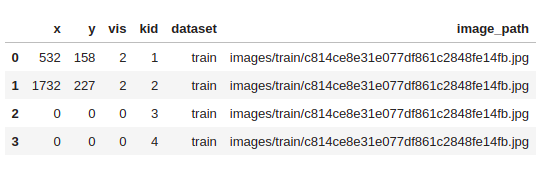
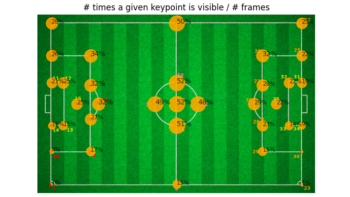
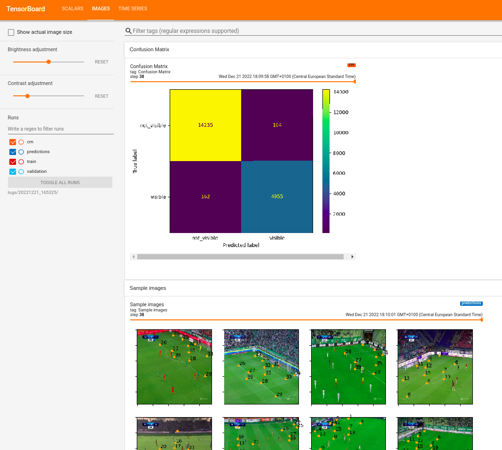
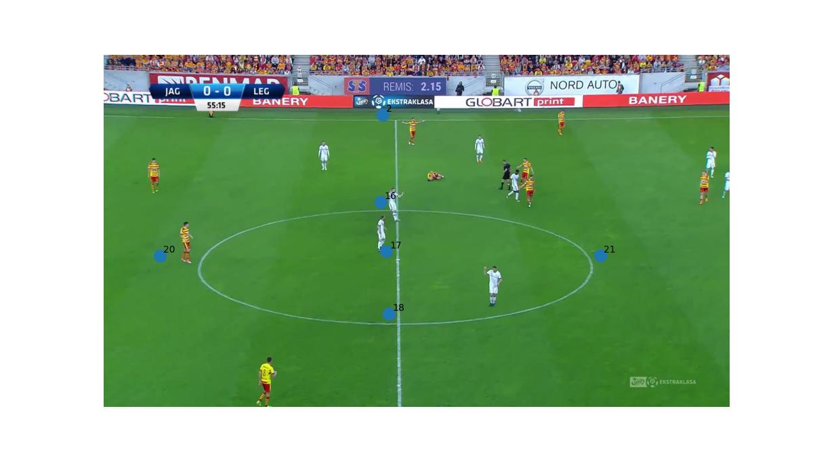

# Pitch Geometry

For a given image showing a fragment of a football pitch, output the position of visible keypoints. 
The keypoints are labeled according to the map on the left and
an exemplary image and its annotated keypoints are on the right:

<p float="left">
  
  
</p>

## Installation

My solution is containerized with Docker containers. There are containers for training, running inference and 
visualizing keypoints on images. To build the Docker images, run in the terminal:
```shell
$ docker/build.sh
```

Images for training and inference use `tensorflow 2.9.1` as a base image.

## Running the code

To open a jupyter lab session and start training a model, run:

```shell
$ runners/training_jupyter.sh
```

The training pipeline is described in `Training.ipynb`.

The inference pipeline can be run with a command
```shell
./runners/infer.sh
```
<details>
  <summary>Infer script usage</summary>

```  
Usage: inference.py [OPTIONS]

  Run inference on images from a given folder.

  Args:

      model_name: Path to a folder containing a saved_model.

      input_dir: Directory containing images for inference.

      output_csv: Path to a csv file the keypoints will be saved in.

      batch: Size a batch which the images are processed in.

Options:
  --model-name PATH  [default: ./best_model]
  --input-dir PATH   [default: ./data/images/test]
  --output-csv PATH  [default: ./outputs/output_keypoints.csv]
  --batch INTEGER    [default: 32]
  --help             Show this message and exit.
```shell

```
</details>

Once you have keypoints you can generate images with the keypoints plotted on them.
Use `./runners/show_keypoints.sh` for this.
<details>
  <summary>show_keypoints script usage</summary>

```
Usage: show_keypoints.py [OPTIONS] KEYPOINTS_FILEPATH IMAGES_DIR OUTPUT_DIR

  Plot keypoints on images.

  Args:

      keypoints_filepath: Filepath to the file containing a data frame with
      keypoints.

      images_dir: Folder containing images that keypoints file refers to.

      output_dir: Folder where the processed images will be saved.

Arguments:
  KEYPOINTS_FILEPATH  [required]
  IMAGES_DIR          [required]
  OUTPUT_DIR          [required]

Options:
  --help  Show this message and exit.
```

</details>

## Project description

This project started as my recruitment task. 
I have got a kind permission from the recruiter to show this project at my personal GitHub account.
I am only sharing my code, thoughts and findings. I am not sharing the data, apart from a few examples which are used
to visualize the results.

I wanted to add this project to my portfolio, because it is different from typical object classification / detection
and forced me to implement custom loss function, custom data augmentation. 
I also created some Tensorboard callbacks for better monitoring of training.
I just think it is a lot of cool stuff!

### About the dataset

The dataset consists of 3822 train images and 290 test images, each of them having a FullHD size (1920 by 1080).  
The images are screenshots taken from TV transmissions of football matches. 
They show a football pitch from a varying angle and position. 
A lot of the images also show a part of a stand for spectators, and some information that are being displayed 
on the TV screen: like a match's result.

There is also a .csv file given, which contains the keypoint data. It has the following columns:
* `x` and `y`: *x* and *y* coordinates on the image.

* `vis`: tells if the particular keypoint is visible on the image. 
  
* `kid` is the keypoint id, selected accordingly to the 
[keypoints map](keypoint-map). 
  
* `dataset`: can be either "train" or "test"

* `image_path`: a relative path to the corresponding image file.



There is a convention that if the point is not visible then its *xy* coordinates are zeroed out.
Coordinates and visibility are also zeroed out for the test keypoints,
so I don't know the ground truth for the test data.

[comment]: <> (I found that although there are 39 unique keypoints in the .csv file a few o them are never labeled as visible.)
[comment]: <> (Also looking at the template map [keypoints map]&#40;keypoint-map&#41; one can detect that there are only 34 distinct points visible )

### The data imbalance

There is one big problem with this dataset: most of the images show only a tiny part of the field, 
leaving the majority of the keypoints invisible. 
Furthermore, some keypoints appear substantially more often than others. 
This is demonstrated at the map below. It shows a percent of all frames where a given keypoint is visible.
Each circle size is relative to this percentage.


As can be seen, the most frequent keypoints are those in the center of the field, but even they are visible on only 
half of all images.

### My solution

Because there is a fixed number of all possible keypoints and every keypoint can appear at most once on each image
I decided to formulate this as a regression problem, where for each image my model outputs an array of a fixed size,
containing the coordinates of each keypoint.

At first I wanted to rely on the fact that if a keypoint is not visible then its *xy* coordinates are zeros.
But I learnt a hard lesson: because most of the points are not visible the model "thought" it would be most beneficiary
to predict all the keypoints as not visible (with zeroed out $x$ and $y$). 
It was trapped in a poor local minima and cannot train any further.

After that I understood that if the training has to be successful the model has to learn simultaneously two separate 
tasks: predicting a keypoint's position and predicting its visibility.

#### The loss function

Every one of these two tasks, predicting position and predicting visibility should have a 
different loss, and the model's objective would be to minimize a weighted sum of those losses:

$$ TotalLoss = \lambda \cdot PositionLoss + (1 - \lambda) \cdot VisibilityLoss $$

What should be a function for each of those individual losses? I think that it is an easy choice for *VisibilityLoss*: 
it is just a binary classification for each keypoint (*visible* vs *not visible*) 
so for that I am using a binary crossentropy. *PositionLoss* is slightly more subtle.

I could take MSE loss on *xy* coordinates, but it then it would punish the model for predicting wrong coordinates for 
keypoints that are not visible. I would like instead to measure MSE loss only on the keypoints that 
I know to be visible, utilizing an idea of *teacher forcing*.
Teacher forcing ([wikipedia article](https://en.wikipedia.org/wiki/Teacher_forcing)) 
was originally used with recurrent neural networks: 
the recurrent model uses a ground truth from a prior time step as input. 

In my case teacher forcing means that I take ground truth keypoints, select those which are visible and calculate the 
MSE loss between them, and their corresponding predicted keypoints. This way the model is not punished for predicting
wrong coordinates of keypoints which are not visible and can learn those tasks completely separately. 

A reader interested in the implementation of the loss can view it here:
[pitch_geo/models/loss.py](pitch_geo/models/loss.py). 

#### Data augmentation

The data set is not very big (3822 images). In such cases it is most often beneficiary to use data augmentation, 
which is a technique where new data points are artificially created by distorting the data.
Because my data consists not only of images, but also keypoints, I didn't use default tensorflow augmentation,
but I built my own data augmentation. Until now, I've implemented random translation and random rotation, and scaling.

If a keypoint is moved out of the image range due to the transformation, its visibility as well as *xy* coordinates are
zeroed out.

#### Model's architecture

The model is trained with a transfer learning technique. As a backbone I used an
[`efficient net b1`](https://keras.io/api/applications/efficientnet/#efficientnetb1-function) model.
I chose this model because I think that it delivers good accuracy with reasonable speed.

The backbone's weights are frozen during the entire training (they are not treated as trainable parameters).
I might add fine-tuning of some of the backbone's layers in the future.

The backbone network is followed by a few convolutional layers - there is no dense layer.
For one image the network's output is a tensor of shape `(number_of_keypoints, 3)`.
The *xy* coordinates as well as visibility are all normalized to lie between 0 and 1.

[comment]: <> (Add the network's graph visualization)

#### Metrics

I used several metrics for tracking my model's performance.
For tracking visibility classification I measured precision and recall.
For tracking coordinates regression I measured MSE loss.

I've also logged to tensorboard a confusion matrix, and a batch of sample predictions after each epoch.
The confusion matrix shows visible vs invisible classification.

<details>
  <summary>Click me to see a sample view of my Tensorboard dashboard</summary>

  
</details>

### Current results

My current model achieves 0.03512 RMSE loss on visible keypoints. 
It is 57.954341 RMSE loss on visible keypoints measured on coordinates after rescaling
(pushing them back to lie in 1920 by 1080 image).

Classification of points' visibility yields 0.9886 precision and 0.9896 recall.

Below there are some examples of predictions on the test set

<p float="left">
  
   
  
</p>

## For developers

There is one additional container, based on the training container, with some dev tools installed.
Currently, the tools are `Black` for formatting and `pytest` for testing.

You have to build the container with:
```shell
./docker/build_dev.sh
```

Then you can start the container with:
```shell
./runners/dev_tools.sh
```
