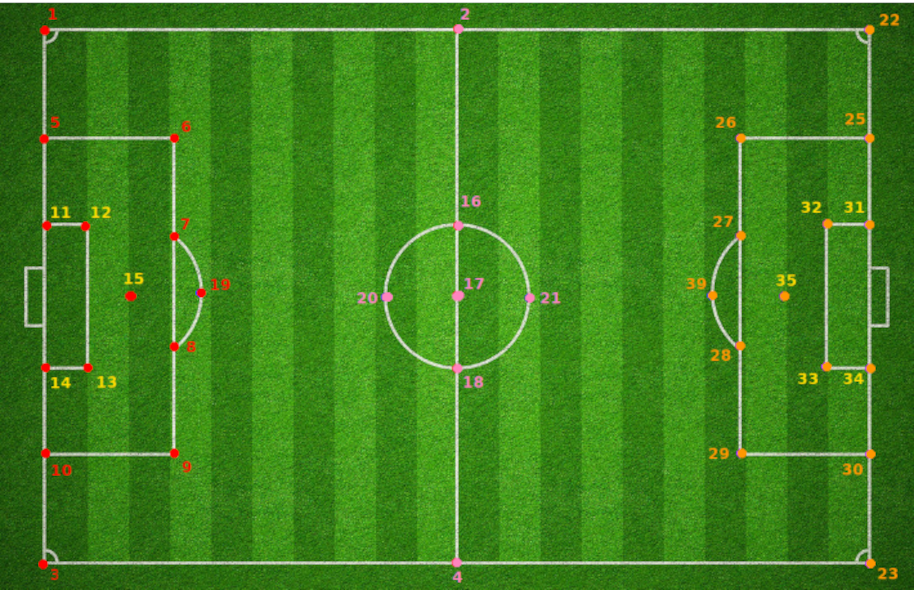

# Pitch Geometry

For a given image showing a fragment of a football pitch, output the position of visible keypoints. 
The keypoints are labeled according to this map:



An example image and its annotated keypoints are shown below:


**Keywords**: computer vision, deep neural network, custom loss function, data augmentation.
## Installation

My solution should be run in a docker container. To build the Docker image, run in the terminal:
```shell
$ docker/build.sh
```

It pulls the image with `tensorflow 2.9.1` and installs additional dependencies.

## Running the solution

The run the container, run:
```shell
$ docker/run.sh
```

The training pipeline is described in `Training.ipynb` and can be run in the notebook. To start a jupyter lab session, 
run
```shell
$ jupyter-lab
```

The inference pipeline can be run through a command
```shell
python3 inference.py --model MODEL --input_dir INPUT_DIR [--batch BATCH --output_csv OUTPUT_CSV

Arguments:
--model MODEL, -m MODEL
                        Path to the saved model.
--input_dir INPUT_DIR, -i INPUT_DIR
                        Directory containing images for inference. This directory must be inside ./data/ folder.
--batch BATCH, -b BATCH
                        Batch size.
--output_csv OUTPUT_CSV, -o OUTPUT_CSV                        
                        Filename of a csv file with keypoint annotations.
```

## Project description

This project started as my recruitment task. 
I have got a kind permission from the recruiter to show this project at my personal GitHub account.
I am only sharing my code, thoughts and findings. I am not sharing the data, apart from a few examples which I use to 
visualize the results.

### About the dataset

The dataset consists of 3822 train images and 290 test images, each of them having a FullHD size (1920 by 1080).  
The images are screenshots taken from TV transmissions of football matches. 
They show a football pitch from a varying angle and position. 
A lot of the images also show a part of a stand for spectators, and some information that are being displayed 
on the TV screen: like a match's result.

There is also a .csv file given, which contains the keypoint data. It has the following columns:
* `x` and `y`: *x* and *y* coordinates on the image.

* `vis`: tells if the particular keypoint is visible on the image. 
  
* `kid` is the keypoint id, selected accordingly to the 
[keypoints map](keypoint-map). 
  
* `dataset`: can be either "train" or "test"

* `image_path`: a relative path to the corresponding image file.


There is a convention that if the point is not visible then its *xy* coordinates are zeroed out.
Coordinates and visibility are also zeroed out for the test keypoints,
so I don't know the ground truth for the test data.

[comment]: <> (I found that although there are 39 unique keypoints in the .csv file a few o them are never labeled as visible.)
[comment]: <> (Also looking at the template map [keypoints map]&#40;keypoint-map&#41; one can detect that there are only 34 distinct points visible )

### The data imbalance

There is one big problem with this dataset: most of the images show only a tiny part of the field, 
leaving the majority of the keypoints invisible. 
Furthermore, some keypoints appear substantially more often than others. 
This is demonstrated at the map below. It shows a percent of all frames where a given keypoint is visible.
Each circle size is relative to this percentage.


As can be seen, the most frequent keypoints are those in the center of the field, but even they are visible on only 
half of all images.

### My solution

Because there is a fixed number of all possible keypoints and every keypoint can appear at most once on each image
I decided to formulate this as a regression problem, where for each image my model outputs an array of a fixed size,
containing the coordinates of each keypoint.

At first I wanted to rely on the fact that if a keypoint is not visible then its *xy* coordinates are zeros.
But I learnt a hard lesson: because most of the points are not visible the model "thought" it would be most beneficiary
to predict all the keypoints as not visible (with zeroed out $x$ and $y$). 
It was trapped in a poor local minima and cannot train any further.

After that I understood that if the training has to be successful the model has to learn simultaneously two separate 
tasks: predicting a keypoint's position and predicting its visibility.

#### The loss function

Every one of these two tasks, predicting position and predicting visibility should have a 
different loss, and the model's objective would be to minimize a weighted sum of those losses:

$$ TotalLoss = \lambda \cdot PositionLoss + (1 - \lambda) \cdot VisibilityLoss $$

What should be a function for each of those individual losses? I think that it is an easy choice for *VisibilityLoss*: 
it is just a binary classification for each keypoint (*visible* vs *not visible*) 
so for that I am using a binary crossentropy. *PositionLoss* is slightly more subtle.

I could take MSE loss on *xy* coordinates, but it then it would punish the model for predicting wrong coordinates for 
keypoints that are not visible. I would like instead to measure MSE loss only on the keypoints that 
I know to be visible, utilizing an idea of *teacher forcing*.
Teacher forcing ([wikipedia article](https://en.wikipedia.org/wiki/Teacher_forcing)) 
was originally used with recurrent neural networks: 
the recurrent model uses a ground truth from a prior time step as input. 

In my case teacher forcing means that I take ground truth keypoints, select those which are visible and calculate the 
MSE loss between them, and their corresponding predicted keypoints. This way the model is not punished for predicting
wrong coordinates of keypoints which are not visible and can learn those tasks completely separately. 

A reader interested in the implementation of the loss can view it here:
[pitch_geo/models/loss.py](pitch_geo/models/loss.py).

